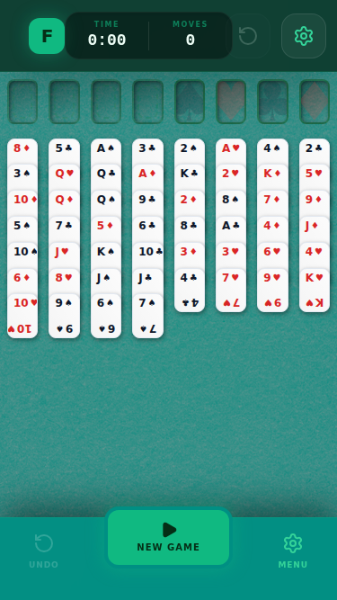
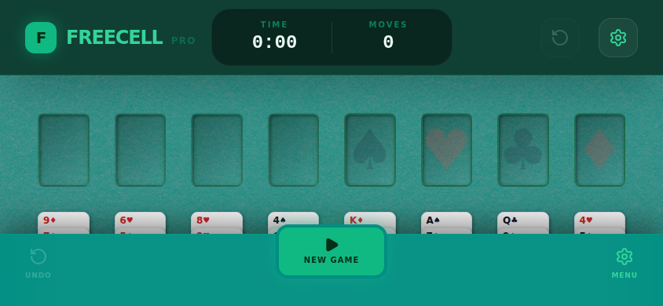

# FreeCell Pro - Style Guide & Design Decisions

This document outlines the design language, UI/CX requirements, and architectural decisions for FreeCell Pro.

## Visual Identity: "Emerald Pro"

The "Emerald Pro" theme is designed to evoke a premium, physical card table experience while maintaining a modern, high-performance digital feel.

### Color Palette

| Element | Color | Token / Hex |
| :--- | :--- | :--- |
| **Primary Background** | Emerald Green | `#008f83` |
| **Table Texture** | Felt Pattern | [Transparent Textures](https://www.transparenttextures.com/patterns/felt.png) |
| **Header/Navigation** | Deep Emerald | `#062c1e` / `bg-[#062c1e]/80` |
| **Card Surface** | Off-White | `#fcfcfc` |
| **Red Suits** | Rose Red | `text-red-600` |
| **Black Suits** | Slate Black | `text-slate-900` |
| **Accents** | Bright Emerald | `text-emerald-400`, `bg-emerald-500` |

### Typography

- **Primary Font**: Sans-serif (Vite default stack).
- **Headings/UI Labels**: Black (900/font-black) weight, uppercase, tracking-tighter/widest for contrast.
- **Card Ranks**: Ultra-bold black weight for maximum legibility.

---

## Responsive Layouts & Breakpoints

The application is optimized for four primary form factors.

### 1. Mobile Portrait (<= 640px)
**Screenshot:** 

- **Layout**: "Perfect Layout" implementation with gold-accented header and integrated actions.
- **Header**: Contains title "FREECELL PRO", "New Game", "Time/Moves" stats, and circular "Settings/Undo" buttons.
- **Card Design**: Traditional vertical layout (`flex-col`) for rank and suit. Center icons are visible (15% opacity).
- **Stacking**: Optimized vertical stacking with reduced gap (`0.25rem` rem base) to prevent overflow.

### 2. Mobile Landscape (<= 1024px width AND <= 600px height)
**Screenshot:** 

- **Layout Choice**: Uses the mobile-style HUD and card compression even at wider widths to account for limited vertical space.
- **Bottom Navigation**: Sticky HUD remains visible for quick access.
- **Card Design**: Uses horizontal rank/suit layout.

### 3. Desktop (Standard)
**Screenshot:** 

- **Card Design**: Traditional vertical layout (`flex-col`) for rank and suit. Large watermark-style center icons (8% opacity).
- **Interactions**: Full drag-and-drop support with shadow transitions.

### 4. Ultrawide (> 2000px)
**Screenshot:** 

- **Max Width**: Board width capped at 2500px for visual balance.
- **Side Panels**: Dedicated panels for "Local Hall of Fame" (left) and "Recent Activity" (right).
- **CX**: High-density display with scaled card visuals.

---

## Key Design Decisions

### 1. Local-Only Persistence
- **Decision**: No server-side components. All data is stored in `localStorage` under the key `freecell-stats`.
- **Reasoning**: Ensures privacy, offline playability, and zero-latency stats updates.

### 2. Adaptive Stacking Algorithm
- **Decision**: Dynamic calculation of card offsets based on column height and viewport height.
- **Implementation**: `getCardOffset` function in `App.jsx`.

### 3. "Twin Highlight" Feature
- **Decision**: Highlighting matching rank/suit color pairs (e.g., Red 7s).
- **Reasoning**: Improves player CX by assisting in pattern recognition and move planning.

### 4. Accessibility & UX
- **Keyboard Shortcuts**: `Ctrl+Z` (Undo), `N` (New Game).
- **Touch-First**: Explicit `onTouchStart` handlers and disabled viewport scaling for mobile.
- **Visual Feedback**: `backdrop-blur-2xl` and `animate-pop` for overlays to maintain table context.

---

## External References

- **Known Good Stitch Reference**: Project `2204865451650378038` (Ultrawide layout balance).

### Stitch Reference Assets
- **Ultrawide Reference**: [Stitch Screen](https://lh3.googleusercontent.com/aida/AOfcidU4nnNXtbdnCTz1arG1MZf5rNxV9ffooNkGHihskvk6-OYy_4pkwsKUyTMYRbqNAYKBH80Ry4Gy7bRGBzjLHj2VlWaPML4VRVWsUy4VxQPMWCkKBm3oU3JdvTrLWeMjnwIqskGzRhHXgFIV23eN76BsHx1xiET3rTQaSJpwhgQCtmQygujfhWwP9zSfVKrZ0NXFb4gok2Oq_2SoOM9CzznVZQPeC-fEfaDDesJzLKjAHg4tQPQzWfArOjjEmkp3f45X5RSr6-Xf)
- **Mobile Reference**: [Stitch Screen](https://lh3.googleusercontent.com/aida/AOfcidUhyB5MjtxdY6pZ0HSxp39BL_bN-qnhpt8SjetfefW2V4oywwPK1N2ac0NlkGtWVmFuB3oHnEt3XPxAqEaVt2KOkOda_S4DnjAJ0ZFJn2RZVhU3HNRc68aFCw0sZKoc1snVGvdgeOTO3v-94SSVzz7G_0G-atmu7M2PFMIohPgtpHUOwqZjg8Zmq-kXM4mwL_lAQ2xMr7Jid4pq1B_K64hDyqyOBGRqr0WLELl4qwHIf5iFoB4eEn4OrjU)
